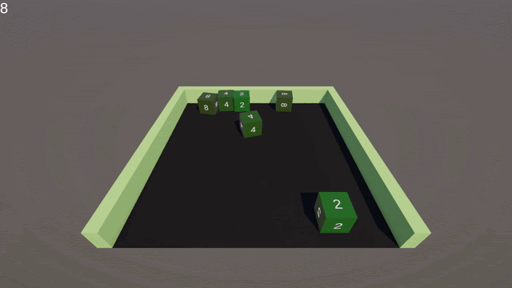

# 2048 3D Prototype

A physics-based 3D reinterpretation of the classic 2048 game, where players launch cubes to merge values and score points.

## Technologies
- Unity 6.0 (6000.0.51f1)
- Zenject (Dependency Injection)

## Features
- Physics-based cube launching
- Merge mechanics based on collision impulse
- Power-of-2 progression system (2, 4, 8, 16...)
- Score system tied to merge values
- Modular and scalable architecture

## How to Run

1. Open the project in Unity Hub
2. Use Unity version: 6000.0.x (most likely will work on higher versions)
3. Open scene called "SampleScene"

## Controls

| Action              | Input                          |
|---------------------|--------------------------------|
| Prepare cube        | Hold touch / mouse button      |
| Move left/right     | Drag horizontally              |
| Launch cube         | Release input                  |

## Architecture Notes

- Uses **Zenject** for dependency injection
- Clear separation of:
- Input handling
- Cube logic
- Game rules
- Easily extendable:
- new cube behaviors
- new scoring rules
- different board setups
- Designed for rapid prototyping and scalability

## Feature Demo:

[Video](https://drive.google.com/file/d/1vktF5FKpiwSeM6MzEmC4DZchQc7Tyxy-/view?usp=sharing)
